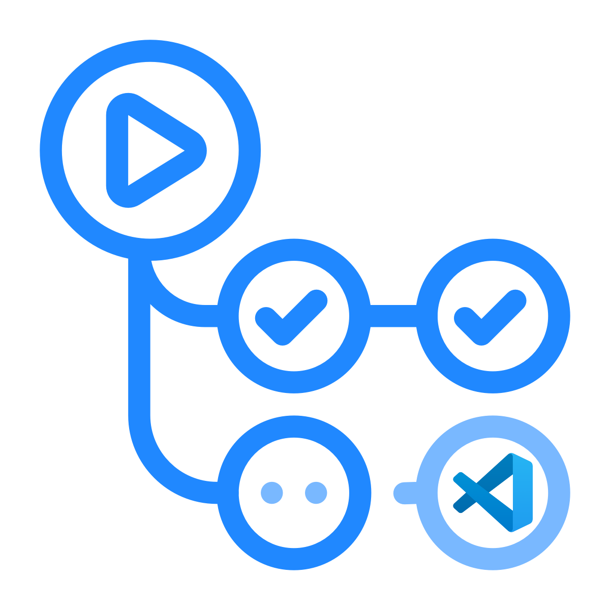

### Welcome 👋

 <link rel="stylesheet" href="https://cdn.jsdelivr.net/gh/devicons/devicon@v2.15.1/devicon.min.css"> 

I am a platform engineer with experience and interest in DevOps, InfraOps, Linux and system automation. I work with Azure and hold AZ-104/400 certifications.

### :computer: Primary Tools & Languages

  
  <!--  -->
  
  
  
  
  
  
  
  <!--  -->
  <!--  -->
  <!--  -->
  
  
  
  
  
  
    

### :computer: Previously Used

  
    

### :link: Links

  
  
  
  

              
### :arrow_upper_right: Current Projects

  
 
- My technical documentation website running on Material of MkDocs [somethingstochastic.com](https://somethingstochastic.com).
- A frontpage [kiersz.dev](https://kiersz.dev) with a CV.
- Homelab - A continued passion with an aim to have a mini datacenter situated on a Startech 25U rack. The main project is temporarly on hold, but previously was done using Terraform, Packer and Docker, Ansible. The main server runs on Unraid Pro for the time being.
- MOTES - An astronomical spectral reduction package as a legacy of my unfinished Doctorial studies. Working with its principal developer [Tom Seccull](https://github.com/tseccull)  :stars:

### Completed / Deprecated Projects

- [Something Stochastic Blog](https://github.com/DAKiersz/something-stochastic-hugo) - The initial incarnation of this was supposed to be a blog, written in Hugo and Bootstrap my your truly. However, time got tight and my efforts concentrated elsewhere, so this domain transfered to my technical documentation website.
- My non-production, Obsidian vault for the public domain. This was a MKDocs website [hosted](https://gitlab.com/dakiersz-group/obsidian-dak-public) on GitLab Pages. This now merged with [somethingstochastic.com](https://somethingstochastic.com) to preserve the domain and is hosted on Github/Azure Static Web Apps.

### :satellite: Experience

You can find my CV on [kiersz.dev](https://kiersz.dev)